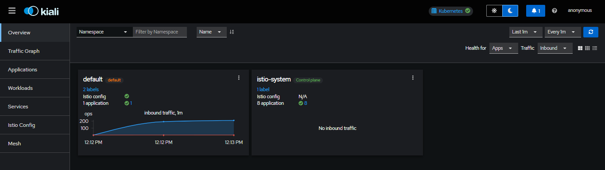
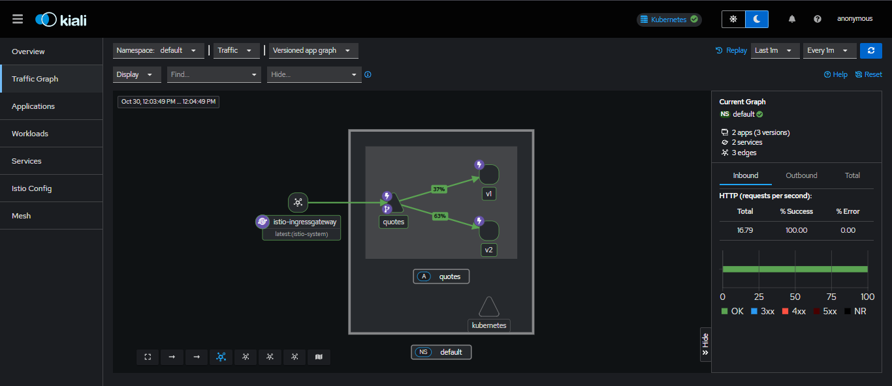

# 🧭 Istio Canary Deployment Demo

A **production-grade Service Mesh implementation** showcasing Istio's traffic management and observability capabilities on Kubernetes. This project demonstrates canary deployments, progressive traffic shifting, and real-time monitoring—key skills for modern DevOps and platform engineering roles.

---

## 🚀 What This Project Does

Deploys a `quotes` microservice with two versions (`v1` and `v2`) to Kubernetes, using **Istio** to intelligently route and observe traffic between them.

**Key Capabilities:**
- Progressive traffic shifting — gradual rollout from v1 → v2
- Resilience patterns — retries, timeouts, circuit breaking
- Real-time observability — live traffic visualization and metrics
- Zero-downtime deployments — canary rollout strategy

---

## 🛠️ Tech Stack

| Layer | Technology |
|-------|-----------|
| **Service Mesh** | Istio |
| **Orchestration** | Kubernetes (Minikube) |
| **Observability** | Kiali, Grafana, Prometheus |
| **Application** | Node.js microservice |
| **IaC** | YAML manifests |

---

## ⚡ Quick Start

```bash
# Start cluster
minikube start --driver=docker

# Install Istio with demo profile
istioctl install --set profile=demo -y
kubectl label namespace default istio-injection=enabled

# Deploy application and Istio configs
kubectl apply -f deployments/

# Expose gateway
minikube tunnel
```

Access the app at `http://127.0.0.1/`

---

## 📊 Live Traffic Management

### Kiali Dashboard — Service Mesh Visualization

*Real-time view of traffic split between quotes v1 and v2*

### Traffic Split Configuration

*Progressive rollout: 90/10 → 50/50 → 0/100 traffic distribution*

**Demo Flow:**
1. Launch Kiali: `istioctl dashboard kiali`
2. Generate load: `while true; do curl http://127.0.0.1/; sleep 0.5; done`
3. Adjust traffic weights in `VirtualService`:
   ```yaml
   - destination:
       host: quotes
       subset: v1
     weight: 50  # Shift traffic gradually
   - destination:
       host: quotes
       subset: v2
     weight: 50
   ```
4. Watch live traffic redistribution in Kiali graph

---

## 💼 DevOps Skills Demonstrated

- **Service Mesh Architecture** — Istio control/data plane concepts  
- **Progressive Delivery** — Canary deployments without downtime  
- **Traffic Engineering** — Fine-grained routing rules and load balancing  
- **Observability** — Distributed tracing, metrics, and topology visualization  
- **Resilience Patterns** — Fault injection, circuit breakers, retries  
- **GitOps Workflows** — Declarative Kubernetes manifests

---

## 📁 Project Structure

```
├── deployments/         # deployments and resources
├── screenshots/         # Demo visuals
└── README.md
```

---

## 🎯 Use Cases

This architecture pattern applies to:
- **Feature flagging** — Test new features with subset of users
- **A/B testing** — Compare service versions under real traffic
- **Safe rollouts** — Gradual migration with instant rollback capability
- **Multi-tenancy** — Route traffic based on headers/user segments

---